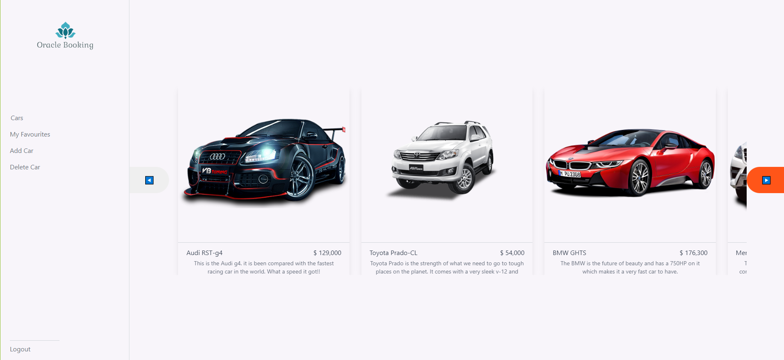
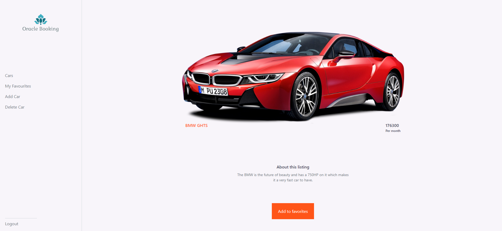

# Oracle booking service





## Live Versions

- [Front-End](https://protected-ocean-24892.herokuapp.com/)
- [Back-end](https://gentle-springs-58920.herokuapp.com/)

## Link to the backend

- [Backend](https://github.com/vic778/Oracle-booking-API)

## Built With

- ReactJS
- Redux Toolkit
- TailwindCSS

## Getting Started

- Getting a local copy is simple. Follow the steps below

### Install

- Node
- npm
- git

### Local Copy

- Clone the project

```
git clone https://github.com/afizsavage/oracle-booking
```

## Setup

### For the frontend

```
npm install
```

Start server(frontend):

```
npm start
```

The front end app will open automatically to the default browser

### Run the tests

```
npm run test
```

## Authors

👤 **Victor Chukwuemeka**

- GitHub: [@githubhandle](https://github.com/chukwuemeka1234/)
- Twitter: [@twitterhandle](https://twitter.com/@avc_victor)
- LinkedIn: [LinkedIn](https://www.linkedin.com/in/vic-chukwuemeka/)

👤 **Afiz Savage**

- GitHub: [@afizsavage](https://github.com/afizsavage)
- Twitter: [@fizzo_geek](https://twitter.com/fizzo_geek)
- LinkedIn: [@afiz-savage](https://www.linkedin.com/in/afiz-savage-3b91a21ba/)

👤 **Ricky Mormor**

- GitHub: [@cwaku](https://github.com/cwaku)
- LinkedIn: [Ricky Mormor](www.linkedin.com/in/rickymormor)
- Instagram: [@rickymormor](https://instagram.com/rickymormor)
- Twitter: [@rickymormor](https://twitter.com/rickymormor)

## 🅰️ Acknowledgements

The design template is provided by
[Creative Commons](https://creativecommons.org/)

## 🤝 Contributing

Contributions, issues, and feature requests are welcome!

## Show your support

Give a ⭐️ if you like this project!
